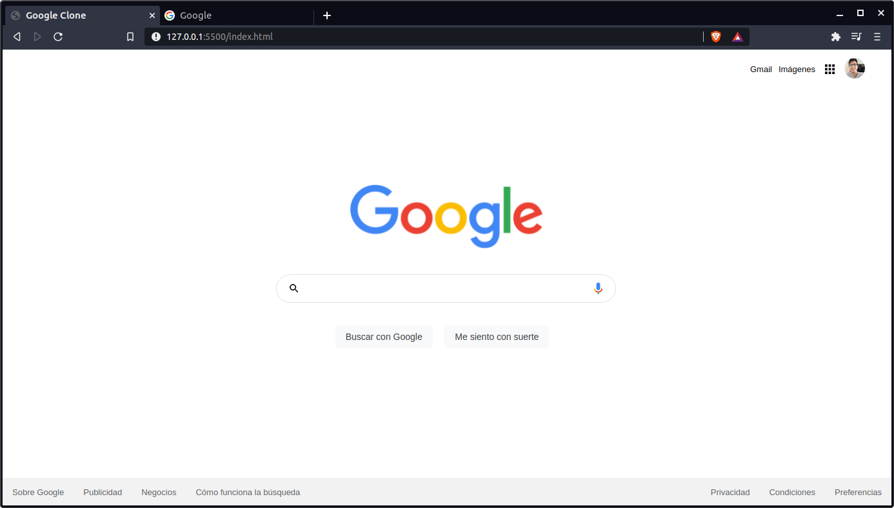

# Google Clone
Proyecto realizado para crear un Google Clone con el fin de poner en práctica lo aprendido en el curso de fundamentos de HTML y CSS.

### Recursos utilizados
- Desktop con Ubuntu 20.04
- Visual Studio Code
- Chrome / Brave Browser
- Muchas ganas de aprender 💪

### Resultado

